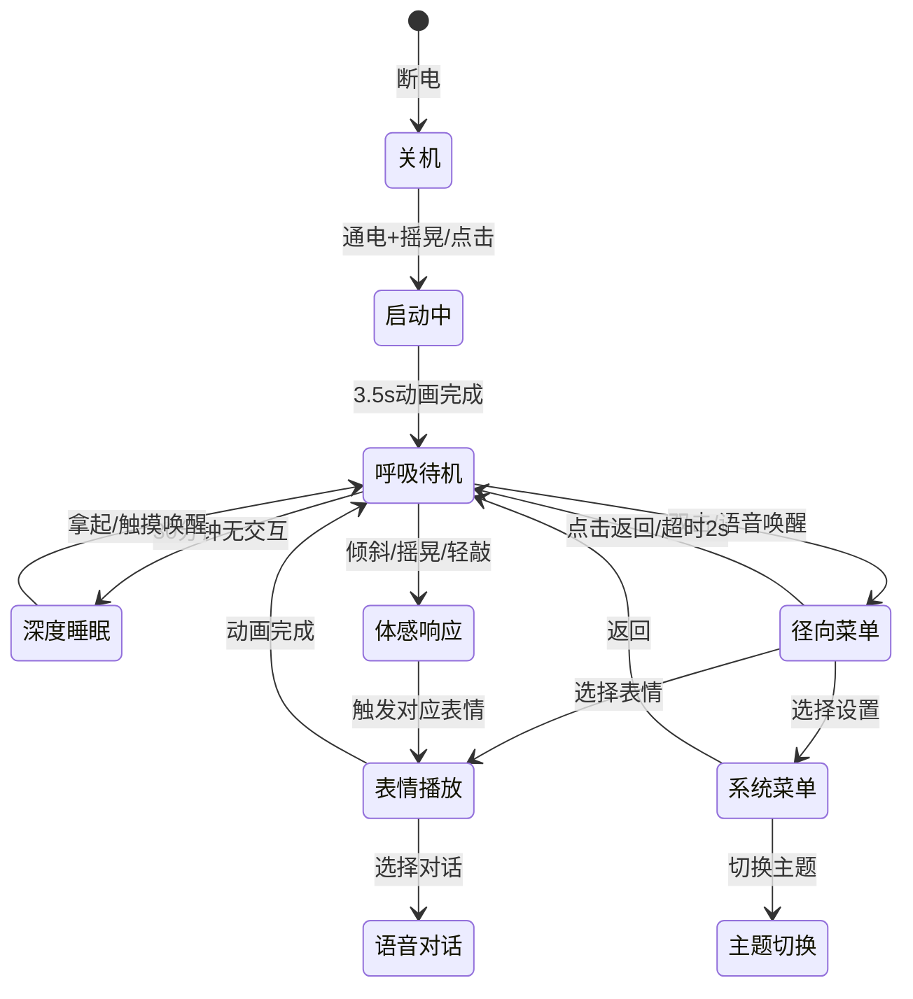

# 桌面机器人UI完整设计文档 v5.0

## 文档信息

| 项目 | 内容 |
|------|------|
| **文档版本** | v5.0 |
| **创建日期** | 2026-05-19 |
| **适用硬件** | M5Stack CoreS3 (320×240屏幕, 6轴IMU) |
| **目标受众** | AI设计师/前端开发者 |
| **技术栈** | React + TypeScript + Framer Motion |

---

## 一、设计愿景

### 1.1 核心理念

> **"从电子玩具到数字伙伴的情感连接升级"**

通过精密的呼吸动画、自然的瞳孔微动、灵敏的体感交互、以及个性化的记忆系统，让320×240像素的小屏幕展现出真实的"生命感"。

### 1.2 人格设定

| 主题 | 人格特征 | 呼吸节奏 | 色彩语言 |
|------|---------|---------|---------|
| **Tech** | 冷静观察者 | 规律稳定 | 青色冷光 #22D3EE |
| **Child** | 好奇宝宝 | 活泼轻快 | 珊瑚橘暖 #FF7F50 |
| **Dev** | 专业协作者 | 精准高效 | 荧光绿 #22C55E |

---

## 二、核心交互架构

### 2.1 交互分层模型

```
┌─────────────────────────────────────────────────────────────┐
│                    交互维度矩阵                              │
├──────────┬──────────┬──────────┬──────────┬─────────────────┤
│  维度     │  基础版   │  进阶版   │  极客版   │    开发者接口    │
├──────────┼──────────┼──────────┼──────────┼─────────────────┤
│ 触控      │ 单击/双击 │ 滑动/长按 │ 组合手势  │  自定义热区API   │
│ 体感      │ 拿起唤醒  │ 倾斜/轻敲 │ 摇晃/旋转 │  IMU数据流订阅   │
│ 语音      │ 唤醒词    │ 简单指令  │ 连续对话  │  ASR回调接口     │
│ 视觉      │ 表情动画  │ 主题切换  │ 粒子特效  │  动画编辑器      │
│ 反馈      │ 屏幕显示  │ 音效+震动 │ RGB灯效   │  多模态绑定      │
└──────────┴──────────┴──────────┴──────────┴─────────────────┘
```

### 2.2 状态机设计



---

## 三、呼吸模式系统（核心）

### 3.1 呼吸曲线数学模型

**Modified Sine with Staged Easing**

```
f(t) = base + amplitude × sin(2π × t/T - π/2) × easeCurve(t)

easeCurve分段：
  0-20%:  cubic-bezier(0.42, 0, 1, 1)      // 缓慢加速
  20-80%: linear                            // 匀速
  80-100%: cubic-bezier(0, 0, 0.58, 1)      // 缓慢减速
```

### 3.2 五级呼吸状态详细规格

| 状态 | 周期 | 振幅 | 瞳孔缩放 | RGB亮度 | 触发条件 |
|------|------|------|---------|---------|---------|
| **deep_sleep** | 8000ms | 5% | 60% | 10-20% | lux<10 或 hour<6/hour>22 |
| **light_rest** | 6000ms | 8% | 75% | 20-35% | hour 18-22 + lux<50 |
| **idle** | 4000ms | 10% | 80% | 30-60% | 默认状态 |
| **alert** | 2500ms | 15% | 85% | 50-80% | db>60 或 lux>800 或检测到移动 |
| **excited** | 1500ms | 18% | 90% | 60-90% | 高频交互后 |

### 3.3 关键帧序列（idle状态示例）

| 时间(ms) | Eye缩放 | 瞳孔缩放 | RGB亮度 | 缓动阶段 |
|---------|---------|---------|---------|---------|
| 0 | 100% | 80% | 30% | - |
| 200 | 103% | 82% | 33% | ease-in |
| 600 | 112% | 88% | 45% | linear |
| 1000 | 115% | 90% | 50% | linear |
| 1500 | 112% | 88% | 55% | linear |
| 1900 | 105% | 83% | 57% | linear |
| 2000 | 115% | 100% | 60% | ease-out峰值 |
| 2100 | 112% | 90% | 58% | ease-in |
| 2500 | 105% | 85% | 50% | linear |
| 3000 | 100% | 82% | 40% | linear |
| 3500 | 98% | 81% | 35% | linear |
| 3800 | 99% | 80.5% | 32% | ease-out |
| 4000 | 100% | 80% | 30% | - |

### 3.4 瞳孔微动漂移系统

**Perlin噪声自然注视模拟**

```typescript
const pupilVariants = {
  idle: {
    // 8秒周期的自然漂移轨迹
    x: [0, 2, -1, 3, 0, -2, 1, 0],      // X轴偏移：±5px
    y: [0, -1, 2, 0, -2, 1, -1, 0],     // Y轴偏移：±3px
    scale: [0.8, 0.85, 0.9, 0.85, 0.8], // 呼吸同步缩放
    transition: {
      x: { duration: 8, repeat: Infinity, ease: "linear" },
      y: { duration: 8, repeat: Infinity, ease: "linear" },
      scale: { duration: 4, repeat: Infinity, ease: [0.42, 0, 0.58, 1] }
    }
  },
  
  deep_sleep: {
    x: 0, y: 0,
    scale: [0.6, 0.65, 0.6],
    transition: { duration: 8 }
  },
  
  alert: {
    x: [0, 3, -3, 0],    // 快速扫视
    y: [0, 2, -2, 0],
    scale: [0.85, 0.95, 0.85],
    transition: { duration: 2.5 }
  },
  
  excited: {
    x: [0, 5, -5, 3, -3, 0],  // 高频抖动
    y: [0, 3, -3, 2, -2, 0],
    scale: [0.9, 1.0, 0.9],
    transition: { duration: 1.5 }
  }
};
```

**设计原则：**
- 瞳孔在Eye形状内移动，不超出边界
- 轨迹为平滑曲线，非直线跳跃
- 偶尔"注视停留"（某点停留300-500ms）
- 垂直偏移始终小于水平偏移（符合人类习惯）

---

## 四、体感交互系统

### 4.1 IMU数据映射

**硬件规格：**
- 加速度计：±2g/±4g/±8g/±16g
- 陀螺仪：±250°/s ~ ±2000°/s
- 采样率：100Hz

**体感动作映射表：**

| 动作 | 检测算法 | 阈值 | Eye响应 | 状态切换 |
|------|---------|------|--------|---------|
| **向前倾斜** | `pitch = atan2(y, z) × 180/π` | >15° | 瞳孔放大+Eye睁大 | curious |
| **向后倾斜** | `pitch = atan2(y, z) × 180/π` | <-15° | 瞳孔缩小+Eye半闭 | yawn |
| **向左倾斜** | `roll = atan2(x, z) × 180/π` | >15° | Eye看向右侧 | look_around |
| **向右倾斜** | `roll = atan2(x, z) × 180/π` | <-15° | Eye看向左侧 | look_around |
| **摇晃** | `magnitude = √(x²+y²+z²)` | >2.5g | 旋转动画 | dizzy |
| **轻敲外壳** | z轴冲击检测 | >1.5g | 单眼眨眼 | wink |
| **拿起唤醒** | 加速度变化 | Δ>0.3g | 睁眼+注视 | idle |
| **旋转180°** | `gyroZ > 180°/s` | 持续0.5s | 倒立Eye | naughty |

### 4.2 体感控制器实现

```typescript
// MotionController.tsx
interface MotionControllerProps {
  onTiltForward: () => void;
  onTiltBackward: () => void;
  onTiltLeft: () => void;
  onTiltRight: () => void;
  onShake: () => void;
  onTapCase: () => void;
  onPickUp: () => void;
  isEnabled: boolean;
}

const THRESHOLDS = {
  TILT: 15,        // 度
  SHAKE: 2.5,      // g
  TAP: 1.5,        // g
  PICKUP: 0.3      // g变化量
};

// 防抖动：500ms内只触发一次
// 摇晃检测：连续3次超过阈值才触发
// 拿起检测：从静止到移动的过渡
```

### 4.3 体感校准界面

在EnvSimulator中增加：
- 实时pitch/roll数值显示
- 2D姿态可视化（圆点在当前姿态位置）
- 一键校准按钮
- 各轴向敏感度调节滑块

---

## 五、径向菜单系统

### 5.1 菜单规格

```
              [表情]
                 ↑
    [随机] ← [Eye] → [对话]
                 ↓
              [菜单]
              
隐藏扇区（滑动展开）：
[设置] [主题] [扩展]
```

### 5.2 动画参数

| 属性 | 数值 | 说明 |
|------|------|------|
| 展开半径 | 70px | 从中心到按钮中心的距离 |
| 按钮尺寸 | 46×46px | 触摸目标足够大 |
| 弹簧阻尼 | 14 | 手感自然不晃动 |
| 弹簧刚度 | 150 | 展开迅速但不突兀 |
| 延迟展开 | 50ms/个 | 顺时针依次展开 |
| 选中缩放 | 1.1x | 轻微放大反馈 |

### 5.3 交互细节

- **唤起**：双击屏幕任意位置 / 语音"你好Eye"
- **选择**：手指滑动到扇区高亮，松手触发
- **取消**：滑动到中心"返回"按钮 / 点击背景 / 2秒超时
- **视觉反馈**：选中项放大+发光，Eye显示预览表情
- **声音反馈**：滑动时音阶递进音效

---

## 六、多模态反馈系统

### 6.1 反馈事件配置

```typescript
interface FeedbackEvent {
  visual: {
    scale: number;
    brightness: number;
    duration: number;
  };
  audio: {
    tone: number;      // Hz
    duration: number;  // ms
    volume: number;    // 0-1
    type: 'sine' | 'square' | 'sawtooth';
  };
  haptic: {
    pattern: number[]; // [on, off, on, off] ms
    intensity: number;
  };
  light: {
    color: [number, number, number];
    brightness: number;
    pulse: boolean;
    fadeDuration: number;
  };
}
```

### 6.2 反馈映射表

| 交互事件 | 视觉 | 音效 | 震动 | RGB灯效 |
|---------|------|------|------|---------|
| **双击唤起** | scale 1.1x | 800Hz/100ms | [50,30,50] | 青色脉冲 |
| **菜单展开** | Eye缩小 | 600Hz/80ms | [20] | 渐亮 |
| **菜单选中** | scale 1.2x | 1200Hz/80ms | [30] | 白色快闪 |
| **体感倾斜** | 轻微偏移 | 500Hz/150ms | [40,20] | 黄色渐变 |
| **摇晃触发** | 剧烈晃动 | 400Hz/300ms | [100,50,100,50,100] | 红色快闪 |
| **呼吸周期** | 自然缩放 | 200Hz/4s | - | 同步呼吸灯 |
| **低电量警告** | 困倦表情 | 200Hz/500ms | [200,200] | 红色慢闪 |

### 6.3 Web Audio API实现

```typescript
const playTone = (frequency: number, duration: number, volume: number = 0.3) => {
  const audioContext = new (window.AudioContext || (window as any).webkitAudioContext)();
  const oscillator = audioContext.createOscillator();
  const gainNode = audioContext.createGain();
  
  oscillator.connect(gainNode);
  gainNode.connect(audioContext.destination);
  
  oscillator.frequency.value = frequency;
  oscillator.type = 'sine';
  
  gainNode.gain.setValueAtTime(volume, audioContext.currentTime);
  gainNode.gain.exponentialRampToValueAtTime(0.01, audioContext.currentTime + duration / 1000);
  
  oscillator.start();
  oscillator.stop(audioContext.currentTime + duration / 1000);
};
```

### 6.4 Vibration API实现

```typescript
const vibrate = (pattern: number[]) => {
  if (navigator.vibrate) {
    navigator.vibrate(pattern);
  }
};

// iOS限制：需要用户手势触发
// Android：支持良好
```

---

## 七、个性化记忆系统

### 7.1 记忆数据结构

```typescript
interface RobotMemory {
  // 时间记忆
  activeHours: number[];        // 活跃小时列表 [6,7,8,20,21]
  lastInteraction: number;      // 时间戳
  consecutiveDays: number;      // 连续使用天数
  
  // 偏好记忆
  favoriteExpressions: Record<string, number>;
  preferredTheme: 'tech' | 'child' | 'dev';
  preferredBreathingSpeed: 'slow' | 'normal' | 'fast';
  
  // 交互统计
  totalInteractions: number;
  totalInteractionTime: number; // 分钟
  gesturePreference: 'touch' | 'motion' | 'voice';
  
  // 情绪历史（最近100条）
  emotionHistory: Array<{
    timestamp: number;
    emotion: string;
    trigger: string;
  }>;
  
  // 成就系统
  achievements: string[];
  unlockedExpressions: string[];
}
```

### 7.2 记忆应用场景

| 场景 | 记忆内容 | 应用效果 |
|------|---------|---------|
| **早安问候** | 首次拿起 + 时间6-10点 + 今天未问候 | 显示"早上好呀！今天也是充满能量的一天。" |
| **表情推荐** | 使用频次最高的表情 | 径向菜单中该表情排在首位 |
| **呼吸调节** | 用户常用的呼吸速度 | 自动调整到用户偏好 |
| **主题记忆** | 上次使用的主题 | 下次开机自动恢复 |
| **互动提醒** | 30分钟无交互 | 显示"呼噜"声+Eye张望 |
| **连续天数** | 连续7天使用 | 解锁"忠实伙伴"成就 |

### 7.3 用户等级系统

| 等级 | 条件 | 解锁能力 |
|------|------|---------|
| Lv1 新手 | 首次开机 | 基础8种表情 |
| Lv2 熟悉 | 累计10次交互 | 隐藏表情×2 |
| Lv3 朋友 | 连续7天使用 | 个性化问候语 |
| Lv4 密友 | 累计100次交互 | 情绪识别系统 |
| Lv5 伙伴 | 连续30天使用 | 高级对话能力 |
| Lv∞ 开发者 | 进入开发者模式 | 完全API控制 |

---

## 八、表情系统详细规格

### 8.1 表情状态列表

| 状态 | 左眼特征 | 右眼特征 | 嘴巴特征 | 触发方式 |
|------|---------|---------|---------|---------|
| **idle** | 自然呼吸+微动 | 同步 | 呼吸同步 | 默认状态 |
| **happy** | 弯月形 | 弯月形 | 大笑 | 菜单选择/自动识别 |
| **wink** | 正常眨眼 | 保持睁开 | 微笑 | 轻敲外壳/菜单 |
| **dizzy** | 旋转 | 旋转 | 圆圈 | 摇晃设备 |
| **crying** | 流泪+下垂 | 流泪+下垂 | 下弯 | 菜单选择 |
| **naughty** | 半闭 | 睁大 | 歪嘴 | 旋转180° |
| **curious** | 睁大 | 睁大 | 小圆 | 向前倾斜 |
| **yawn** | 半闭 | 半闭 | 大圆 | 向后倾斜 |
| **angry** | 眯眼 | 眯眼 | 直线 | 用力敲击 |
| **excited** | 放大+抖动 | 放大+抖动 | 大笑 | 高频交互 |
| **look_around** | 看左 | 看左 | 正常 | 向左倾斜 |
| **deep_sleep** | 几乎闭合 | 几乎闭合 | 微小 | 深夜环境 |

### 8.2 wink动画关键帧（修正版）

```typescript
// 注意：repeat: 0，单次播放
wink: {
  leftEye: {
    height: [40, 2, 4, 40],      // 正常→闭合→微开→恢复
    width: [32, 36, 34, 32],     // 闭合时略微变宽
    y: [0, 10, 8, 0],            // 闭合时向下偏移
    rotate: [0, -18, -15, 0],    // 非对称旋转
    duration: 1500,
    repeat: 0
  },
  rightEye: {
    height: [40, 50, 48, 40],    // 睁大眼睛
    width: [32, 38, 36, 32],
    y: [0, -10, -8, 0],          // 向上挑眉
    rotate: [0, 10, 8, 0],
    duration: 1500,
    repeat: 0
  },
  mouth: {
    width: [24, 48, 46, 24],     // 嘴巴放大配合
    height: [4, 26, 24, 4],
    y: [0, -10, -8, 0],
    rotate: [0, 15, 12, 0],
    duration: 1500,
    repeat: 0
  }
}
```

---

## 九、文字显示规范

### 9.1 禁止区域（绝对不能遮挡）

```
Eye区域：
  X: 80-240px (屏幕宽度25%-75%)
  Y: 60-180px (屏幕高度25%-75%)

嘴巴区域：
  X: 100-220px
  Y: 140-180px
```

### 9.2 允许区域

| 区域 | 位置 | 字号 | 用途 |
|------|------|------|------|
| 顶部状态栏 | Y: 0-20px | 8-10pt | 时间、WiFi、电量图标 |
| 底部对话区 | Y: 200-240px | 10-12pt | 对话气泡、提示 |
| 边缘信息区 | 左右各20px | 8pt | 状态指示、数值 |

### 9.3 对话气泡规格

- **位置**：Eye上方或侧方
- **形状**：圆角矩形+指向Eye的小三角
- **尺寸**：最大160px宽，2行文字
- **字数**：中文≤15字，英文≤30字符
- **动画**：淡入300ms + 停留2-5s + 淡出200ms

### 9.4 文字与呼吸协调

```
文字显示时：
  1. 呼吸暂停500ms
  2. 文字期间呼吸幅度降低50%
  3. 文字消失后逐渐恢复
  
同步策略：
  淡入 → 与呼气阶段同步
  淡出 → 与吸气阶段同步
```

---

## 十、开发者API接口

### 10.1 呼吸控制API

```typescript
class BreathingSystem {
  // 设置呼吸模式
  setBreathingMode(mode: 'deep_sleep' | 'light_rest' | 'idle' | 'alert' | 'excited', intensity?: number);
  
  // 获取当前参数
  getCurrentParams(): {
    period: number;
    amplitude: number;
    easingCurve: string;
    pupilSyncRatio: number;
    lightBrightnessRange: [number, number];
  };
  
  // 注册自定义呼吸
  registerCustomBreathing(name: string, pattern: BreathingPattern);
  
  // 与环境同步
  syncWithEnvironment(env: { lux: number; db: number; hour: number });
}
```

### 10.2 表情控制API

```typescript
class ExpressionController {
  // 播放表情
  play(expression: FaceState, duration?: number);
  
  // 停止当前
  stop();
  
  // 注册自定义
  registerCustom(name: string, animation: AnimationData);
  
  // 随机播放
  playRandom();
}
```

### 10.3 体感控制API

```typescript
class MotionController {
  // 启用/禁用体感
  setEnabled(enabled: boolean);
  
  // 设置阈值
  setThresholds(thresholds: MotionThresholds);
  
  // 校准传感器
  calibrate();
  
  // 订阅事件
  onTilt(callback: (direction: 'forward' | 'backward' | 'left' | 'right') => void);
  onShake(callback: () => void);
  onTap(callback: () => void);
}
```

### 10.4 记忆系统API

```typescript
class MemorySystem {
  // 记录交互
  recordInteraction(action: string, emotion?: string);
  
  // 获取推荐表情
  getRecommendedExpression(): FaceState;
  
  // 是否应该显示早安问候
  shouldShowMorningGreeting(): boolean;
  
  // 获取用户等级
  getUserLevel(): { level: number; title: string };
  
  // 保存配置
  savePreference(key: string, value: any);
  
  // 读取配置
  getPreference(key: string): any;
}
```

---

## 十一、颜色规范

### 11.1 Tech主题

```css
/* 呼吸高光 */
--tech-bright: #33C5FF;     /* HSL: 200°, 100%, 60% */
--tech-dim: #0F4C75;        /* HSL: 200°, 80%, 30% */

/* 发光效果 */
box-shadow: 0 0 20px rgba(34, 211, 238, 0.7);

/* 背景 */
background: #000000;
```

### 11.2 Child主题

```css
/* 呼吸高光 */
--child-bright: #FF9E7D;    /* HSL: 15°, 95%, 70% */
--child-dim: #CC5A3D;       /* HSL: 15°, 85%, 40% */

/* 发光效果 */
box-shadow: 0 0 15px rgba(255, 127, 80, 0.4);

/* 背景 */
background: #FFF9E6;
```

### 11.3 Dev主题

```css
/* 呼吸高光 */
--dev-bright: #22C55E;      /* HSL: 142°, 70%, 50% */
--dev-dim: #15803D;         /* HSL: 142°, 60%, 30% */

/* 发光效果 */
box-shadow: 0 0 15px rgba(34, 197, 94, 0.6);

/* 背景 */
background: #000000;
```

---

## 十二、验收标准

### 12.1 P0 核心功能（必须100%通过）

| 验收项 | 测试方法 | 通过标准 |
|--------|---------|---------|
| 瞳孔微动 | 观察Eye 10秒 | 瞳孔有自然的漂移轨迹，不机械 |
| 呼吸曲线 | 录制动画分析 | 符合13个关键帧时间点，±50ms误差 |
| 体感倾斜 | 倾斜设备15° | Eye响应方向正确，延迟<500ms |
| 体感摇晃 | 摇晃设备 | 触发dizzy动画，3次内成功 |
| wink修复 | 点击wink | 播放1次后停止，不循环 |

### 12.2 P1 增强功能（90%通过率）

| 验收项 | 测试方法 | 通过标准 |
|--------|---------|---------|
| 音效反馈 | 双击屏幕 | 能听到800Hz提示音 |
| 震动反馈 | 选中菜单 | 手机有震动感觉 |
| 早安问候 | 首次打开 | 6-10点显示问候对话框 |
| 记忆记录 | 使用10次 | 能统计出最常使用的表情 |

### 12.3 性能指标

| 指标 | 目标值 | 测试方法 |
|------|--------|---------|
| 帧率 | ≥30fps | 性能面板监测 |
| 首屏加载 | <2s | Lighthouse测试 |
| 交互响应 | <100ms | 用户操作到视觉反馈 |
| 内存占用 | <50MB | 任务管理器监测 |

---

## 十三、迭代路线图

| 阶段 | 任务 | 工时 | 依赖 |
|------|------|------|------|
| **Phase 1** | 瞳孔微动系统 | 4h | - |
| | wink修复 | 0.5h | - |
| **Phase 2** | 体感交互系统 | 8h | Phase 1 |
| | 体感校准界面 | 2h | Phase 2 |
| **Phase 3** | 音效系统 | 3h | - |
| | 震动系统 | 2h | - |
| **Phase 4** | 记忆系统 | 6h | - |
| | 早安问候 | 2h | Phase 4 |
| **Phase 5** | 情绪识别 | 4h | Phase 4 |
| **优化** | 性能优化 | 4h | 全部 |
| **测试** | 全面测试 | 6h | 全部 |

**总计：约40工时（5个工作日）**

---

## 附录：参考文件

| 文件 | 说明 |
|------|------|
| v4.6原型压缩包 | 基础代码框架 |
| 交互设计稿v1.1 | 完整交互设计 |
| 改进设计文档v1.0 | 详细技术实现 |

---

**文档结束**

*本文档完整描述了桌面机器人UI v5.0的全部设计规格，可直接用于开发实现。*
