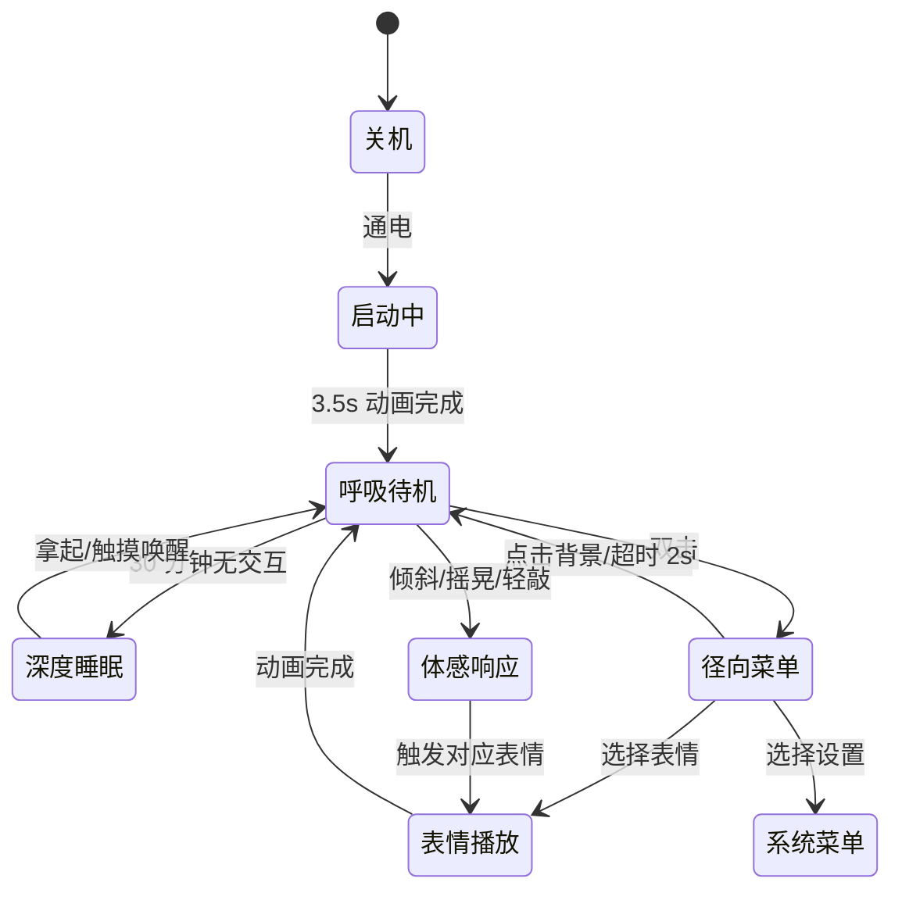

# 桌面机器人 UI 设计规格 v5.0 — Part 1 / 视觉与交互层

> **本文档面向**:UI/UX 设计师、AI 视觉设计工具(Galileo/Figma AI/v0)
> **不包含**:工程实现、硬件接入、API 契约(见 Part 2)
> **目标**:产出可直接用于设计稿与前端动效复刻的视觉与交互规范

---

## 文档信息

| 项目 | 内容 |
|------|------|
| **文档版本** | v5.0 / Part 1 |
| **创建日期** | 2026-05-20 |
| **适用硬件** | M5Stack CoreS3 (320×240 圆角屏幕) |
| **目标受众** | UX/UI 设计师、AI 设计工具 |
| **设计语言** | 数字伙伴 / 生命感 / 极简几何 |

---

## 一、设计愿景

### 1.1 核心理念

> **"从电子玩具到数字伙伴的情感连接升级"**

通过精密的呼吸动画、自然的瞳孔微动、个性化的人格表达,让 320×240 像素的小屏幕展现出真实的"生命感"。设计上避免使用具象人脸,通过双眼 + 嘴巴的几何抽象表达完整情绪谱。

### 1.2 三主题人格设定

| 主题 | 人格特征 | 呼吸节奏 | 主色 | 高光色 | 背景色 |
|------|---------|---------|------|--------|--------|
| **Tech** | 冷静观察者 | 规律稳定 | `#22D3EE` | `#33C5FF` | `#000000` |
| **Child** | 好奇宝宝 | 活泼轻快 | `#FF7F50` | `#FF9E7D` | `#FFF9E6` |
| **Dev** | 专业协作者 | 精准高效 | `#22C55E` | `#22C55E` | `#000000` |

---

## 二、屏幕布局规范

### 2.1 安全区域

```
┌──────────────────────────────────────┐ ← y=0
│ 顶部状态栏 0–20px (可选: WiFi/电量)    │
├──────────────────────────────────────┤ ← y=20
│                                       │
│         👁  Eye 核心区  👁              │ y=60–180
│                                       │
│            ◡ 嘴巴                     │
│                                       │
├──────────────────────────────────────┤ ← y=200
│ 底部对话气泡 / RGB 灯条                │
└──────────────────────────────────────┘ ← y=240
```

### 2.2 文字禁区(绝对不可遮挡)

| 区域 | X 范围 | Y 范围 | 用途 |
|------|--------|--------|------|
| **Eye 核心区** | 80–240px | 60–180px | 双眼区域 |
| **嘴巴区** | 100–220px | 140–180px | 嘴巴区域 |

### 2.3 文字允许区域

| 区域 | 位置 | 字号 | 用途 |
|------|------|------|------|
| 顶部状态栏 | y: 0–20px | 8–10pt | 时间、WiFi、电量 |
| 顶部对话气泡 | y: 4–60px(居中) | 11pt | 对话/建议 |
| 边缘信息条 | 左右各 20px | 8pt | 状态指示数值 |

### 2.4 对话气泡规格

| 属性 | 数值 |
|------|------|
| 位置 | 屏幕顶部居中,距上 4px |
| 形状 | 圆角矩形 16px,带毛玻璃背景 |
| 最大宽度 | 280px(85% 屏宽) |
| 内边距 | 10px |
| 字数 | 中文 ≤15 字,英文 ≤30 字符 |
| 入场动画 | y: -10 → 0,scale: 0.95 → 1,300ms spring |
| 停留时长 | text 类型 5s,suggest 类型 3s |
| 出场动画 | 反向,200ms |

---

## 三、呼吸系统(核心动效)

### 3.1 呼吸曲线数学模型

**Modified Sine with Staged Easing**

```
f(t) = base + amplitude × sin(2π × t/T - π/2) × easeCurve(t)

easeCurve 分段:
  0–20%:   cubic-bezier(0.42, 0, 1, 1)      // 缓慢加速(吸气起始)
  20–80%:  linear                            // 匀速过渡
  80–100%: cubic-bezier(0, 0, 0.58, 1)      // 缓慢减速(呼气结尾)
```

### 3.2 五级呼吸状态规格

| 状态 | 周期 | 振幅 | 瞳孔缩放 | RGB 透明度区间 | 视觉描述 |
|------|------|------|---------|---------------|---------|
| **deep_sleep** | 8000ms | 5% | 60% | 0.1 → 0.2 → 0.1 | 双眼几乎闭合,极慢起伏 |
| **light_rest** | 6000ms | 8% | 75% | 0.2 → 0.35 → 0.2 | 半闭眼,轻微漂移 |
| **idle** | 4000ms | 10% | 80% | 0.3 → 0.6 → 0.3 | 正常睁眼,自然呼吸 |
| **alert** | 2500ms | 15% | 85% | 0.5 → 0.8 → 0.5 | 睁大,快速扫视 |
| **excited** | 1500ms | 18% | 90% | 0.6 → 0.9 → 0.6 | 高频抖动,亮度峰值 |

### 3.3 idle 状态关键帧序列(参考)

| 时间(ms) | Eye 缩放 | 瞳孔缩放 | RGB 透明度 |
|---------|---------|---------|-----------|
| 0 | 100% | 80% | 0.30 |
| 600 | 112% | 88% | 0.45 |
| 1000 | 115% | 90% | 0.50 |
| 2000 | 115% | 100% | 0.60 (峰值) |
| 3000 | 100% | 82% | 0.40 |
| 4000 | 100% | 80% | 0.30 |

### 3.4 瞳孔微动漂移(Perlin 风格)

**8 关键帧 8 秒周期的自然注视轨迹:**

```
X 偏移序列 (px): [0,  2, -1,  3,  0, -2,  1,  0]
Y 偏移序列 (px): [0, -1,  2,  0, -2,  1, -1,  0]
缩放序列:        [0.8, 0.85, 0.9, 0.85, 0.8]  (4 秒周期)
```

**设计原则:**
- 最大水平偏移 ±5px,最大垂直偏移 ±3px(垂直 < 水平,符合人类习惯)
- 瞳孔不超出 Eye 边界
- 轨迹为平滑曲线,非直线跳跃
- 偶尔注视停留 300–500ms

---

## 四、表情系统

### 4.1 表情清单(共 22 种)

| 状态 | 左眼 | 右眼 | 嘴巴 | 触发场景 |
|------|------|------|------|---------|
| **idle** | 自然呼吸+微动 | 同步 | 呼吸同步 | 默认 |
| **breath** | 同 idle | 同步 | 同步 | 同义别名 |
| **happy** | 弯月形 | 弯月形 | 大笑 | 菜单选择 |
| **wink** | 闭合(单次) | 睁大挑眉 | 上扬 | 轻敲外壳 |
| **dizzy** | 360° 旋转 | 360° 旋转 | 圆圈 | 摇晃 |
| **crying** | 半闭+下垂 | 半闭+下垂 | 倒梯形 | 失落场景 |
| **naughty** | 半眯 | 睁大 | 歪嘴 | 旋转 180° |
| **curious** | 偏移上抬 | 偏移上抬 | 小圆 | 向前倾斜 |
| **yawn** | 张开→收拢 | 同步 | 大圆→收拢 | 向后倾斜 |
| **angry** | 下压斜眯 | 下压斜眯 | 微张 | 用力敲击 |
| **excited** | 放大+抖动 | 放大+抖动 | 大笑 | 高频交互 |
| **look_around** | 横向扫视 | 横向扫视 | 横向跟随 | 左/右倾斜 |
| **deep_sleep** | 几乎闭合 | 几乎闭合 | 微小 | 深夜 |
| **light_rest** | 半闭 | 半闭 | 收窄 | 傍晚 |
| **alert** | 睁大快速扫视 | 同步 | 收窄 | 高 lux/db |
| **talking** | 自然 | 自然 | 上下变化 | 对话中 |
| **thinking** | 偏移眯眼 | 偏移收窄 | 小圆偏移 | 思考占位 |
| **surprised** | 极度睁大 | 极度睁大 | 圆形 | 惊讶 |
| **lost** | 下垂歪头 | 下垂歪头 | 倒撇嘴 | 寂寞 |
| **celebrate** | 弹性缩放 | 弹性缩放 | 大笑跳动 | 奖励 |
| **menu** | 缩小淡化 | 缩小淡化 | 缩小淡化 | 菜单覆盖 |
| **sleep_wake** | 渐次睁开 | 渐次睁开 | 渐显 | 唤醒过渡 |

### 4.2 wink 关键帧(单次播放,1500ms)

| 部位 | height | width | y | rotate |
|------|--------|-------|---|--------|
| 左眼 | 40 → 2 → 4 → 40 | 32 → 36 → 34 → 32 | 0 → 10 → 8 → 0 | 0 → -18° → -15° → 0 |
| 右眼 | 40 → 50 → 48 → 40 | 32 → 38 → 36 → 32 | 0 → -10 → -8 → 0 | 0 → 10° → 8° → 0 |
| 嘴巴 | 4 → 26 → 24 → 4 | 24 → 48 → 46 → 24 | 0 → -10 → -8 → 0 | 0 → 15° → 12° → 0 |

> ⚠️ 必须 `repeat: 0`,单次播放后回到 idle。

---

## 五、径向菜单

### 5.1 视觉规格

```
              [表情]
                 ↑
    [随机] ← [Eye] → [对话]
                 ↓
              [菜单]

隐藏扇区(滑动展开): [设置] [主题] [扩展]
```

### 5.2 参数

| 属性 | 数值 |
|------|------|
| 展开半径 | 70px |
| 按钮尺寸 | 46×46px |
| 弹簧阻尼 | 14 |
| 弹簧刚度 | 150 |
| 按钮延迟 | 50ms × index(顺时针) |
| Hover 缩放 | 1.1× |
| 选中亮度 | +50% glow |

### 5.3 交互动画

| 节点 | 动画 |
|------|------|
| 唤起 | 双击屏幕,扇区从中心弹出 |
| Hover | 按钮放大 1.1×,标签淡入 |
| 选中 | 闪光 + 缩放 1.2× + 80ms |
| 取消 | 点击背景 / 2 秒超时,反向收起 |

---

## 六、状态机(用户视角)



---

## 七、特定场景视觉

### 7.1 早安问候

- 触发:首次拿起 + 6:00–10:00 + 当日未问候
- 表情:`sleep_wake`(渐次睁眼)
- 气泡:"早上好呀!今天也是充满能量的一天。"
- RGB 灯条:主题主色,透明度 0.5 → 1.0 → 0.5,周期 0.5s

### 7.2 寂寞超时

- 触发:30 分钟无交互
- 表情:`lost`(下垂歪头)
- 气泡:"好无聊哦,陪我玩一会吧..."
- RGB 灯条:黄色 `#FACC15`,慢闪 4s 周期

### 7.3 互动奖励

- 触发:连续 7 天使用 / 累计达成里程碑
- 表情:`celebrate`(弹性跳动)
- RGB 灯条:主题主色快闪,周期 0.5s

### 7.4 粗暴对待

- 触发:连续摇晃 5 次以上 / 用力敲击
- 表情:`angry`
- RGB 灯条:红色 `#EF4444`,快闪 1.2s 周期,opacity 0.3 → 1.0 → 0.3

---

## 八、开机动画

### 8.1 Tech 主题

1. 0.5s: 黑屏淡入
2. 1.0s: 青色横线从中心展开至 80% 宽
3. 1.5s: "SYSTEM BOOTING..." 字样闪烁
4. 2.5s: 5 个青色方块依次点亮
5. 3.5s: 转入 idle

### 8.2 Child 主题

1. 0.5s: 米黄背景
2. 1.0s: 珊瑚橘圆形从 0 弹出旋转 180° 归位
3. 1.5s: 圆内 ":)" 上下跳动
4. 2.5s: "HELLO!" 字样弹出
5. 3.5s: 转入 idle

### 8.3 Dev 主题

1. 0.1s: 黑底
2. 0.8s: `> INITIALIZING KERNEL...` 打印
3. 1.6s: `> LOADING PERSONALITY MODULE...`
4. 2.4s: `> WAKING UP AI...`
5. 3.0s: 绿色光标闪烁
6. 3.5s: 转入 idle

---

## 九、配色变量表(交付前端)

```css
/* Tech */
--tech-primary:    #22D3EE;
--tech-bright:     #33C5FF;
--tech-dim:        #0F4C75;
--tech-bg:         #000000;
--tech-glow:       0 0 20px rgba(34, 211, 238, 0.7);

/* Child */
--child-primary:   #FF7F50;
--child-bright:    #FF9E7D;
--child-dim:       #CC5A3D;
--child-bg:        #FFF9E6;
--child-glow:      0 0 15px rgba(255, 127, 80, 0.4);

/* Dev */
--dev-primary:     #22C55E;
--dev-bright:      #22C55E;
--dev-dim:         #15803D;
--dev-bg:          #000000;
--dev-glow:        0 0 15px rgba(34, 197, 94, 0.6);

/* 通用 */
--alert-red:       #EF4444;
--lonely-yellow:   #FACC15;
--tear-blue:       #60A5FA;
```

---

## 十、设计交付清单

| 交付物 | 格式 | 说明 |
|--------|------|------|
| Figma 设计稿 | .fig | 包含 22 个表情静帧 + 3 主题 |
| 关键帧动画 GIF | .gif | 5 级呼吸状态各一段 8 秒循环 |
| 开机动画 | .mp4 / Lottie | 3 主题各 3.5s |
| 图标资源 | SVG | 径向菜单 6 图标 + 状态栏图标 |
| 配色 Token | CSS 变量 | 见第九章 |

---

**Part 1 文档结束**
**继续阅读 Part 2:工程实现规格(给 RD / 嵌入式开发)**
